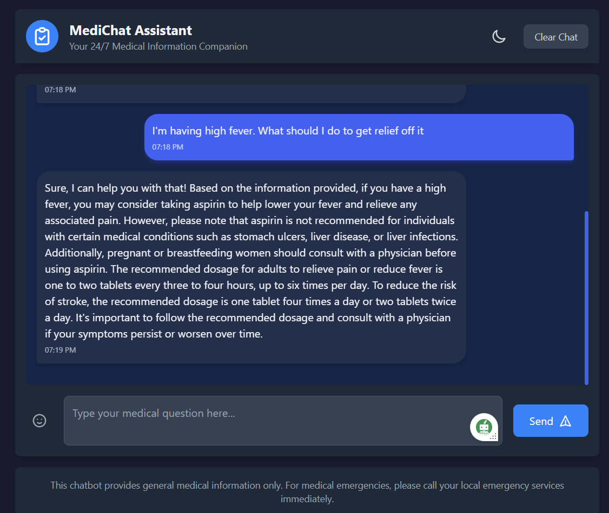
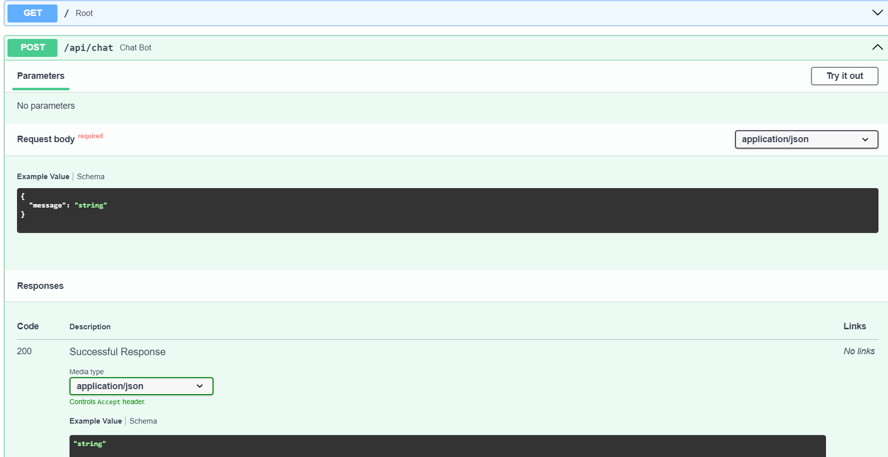

# Medical-Chatbot

A sophisticated medical information retrieval system powered by LLaMA 2 (7B) that leverages RAG (Retrieval-Augmented Generation) architecture to provide accurate medical information.

## 🌟 Features

- **Advanced Language Model**: Utilizes Meta's LLaMA 2 (7B parameters) for natural and contextual responses
- **RAG Architecture**: Implements Retrieval-Augmented Generation for accurate and source-based responses
- **Vector Database**: Employs Pinecone for efficient similarity search and retrieval
- **Dual Interface**:
  - RESTful API built with FastAPI for seamless integration
  - User-friendly web interface for direct interactions
- **Extensible Knowledge Base**: Medical literature database that can be easily updated and scaled

---

## 🚀 Technical Stack

- **Language Model**: LLaMA 2 (7B) - HuggingFace Implementation
- **Backend Framework**: FastAPI
- **Vector Database**: Pinecone
- **Knowledge Base**: Curated medical literature and textbooks
- **API**: RESTful endpoints for programmatic access

## 💡 How It Works

1. **Query Processing**: User inputs are processed and vectorized
2. **Knowledge Retrieval**: Relevant medical information is retrieved from Pinecone
3. **Context Enhancement**: Retrieved information augments the LLaMA 2 model's knowledge
4. **Response Generation**: Model generates accurate, context-aware responses

## 🔧 Setup and Installation

[Installation instructions to be added]

## 🎯 Use Cases

- Medical information lookup
- Symptom exploration
- General medical queries
- Healthcare education support
- Research assistance

## 🔄 Scalability

The system is designed for easy scalability:
- Model loading is a one-time process, reducing response time and resource allocation
- Knowledge base can be expanded by adding new medical literature
- Vector database automatically indexes new information
- No retraining required for incorporating new data
-
## 📊 Performance

- Fast response times through optimized vector search
- High accuracy through RAG architecture
- Reliable source-based information

## 🛡️ Limitations and Disclaimer

This chatbot is designed for `EDUCATIONAL` purposes only and should not be used as a substitute for professional medical advice, diagnosis, or treatment.

## 🔜 Future Enhancements

- Multi-language support
- Integration with medical imaging analysis (OCR)
- Add Speech-to-text and Text-to-speech feature
- Enhanced security features

## 📝 License

This project is licensed under the MIT License. See the [LICENSE](LICENSE) file for details.
